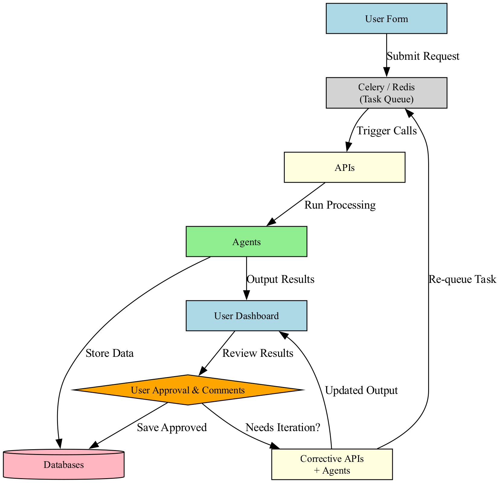
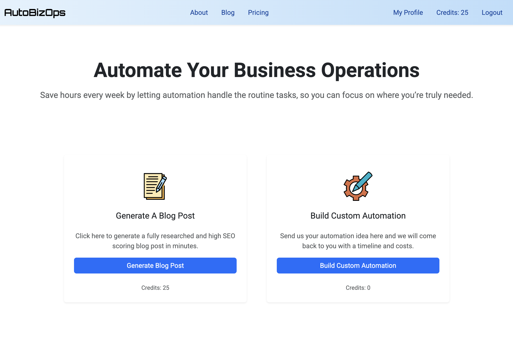
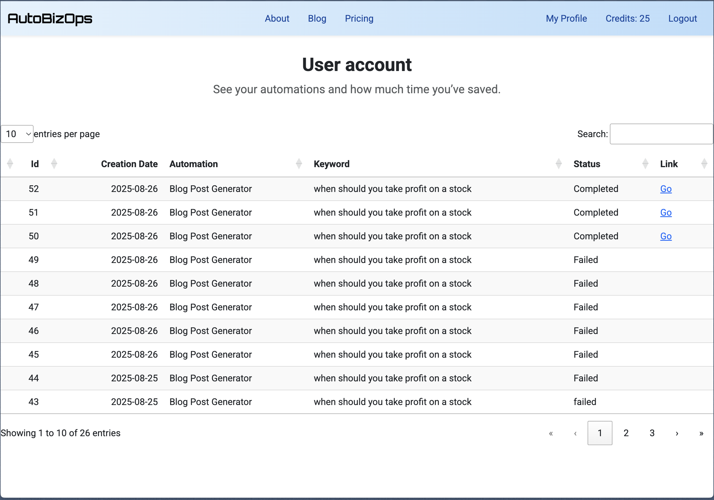
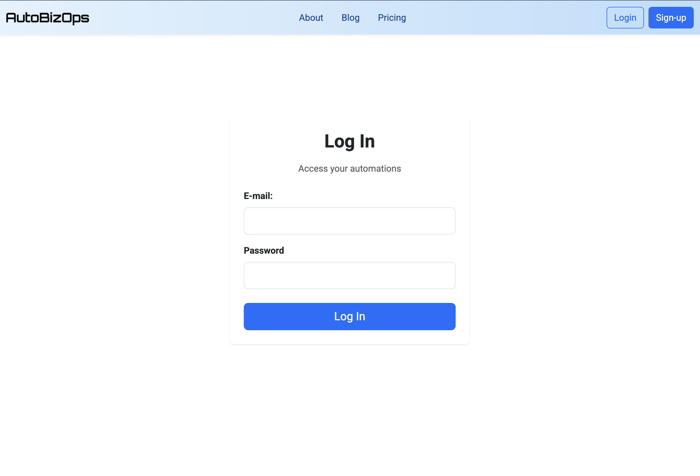
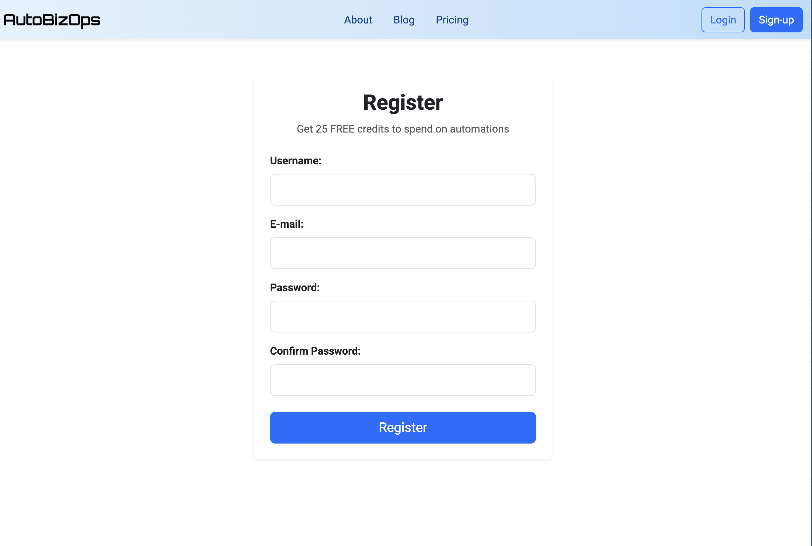
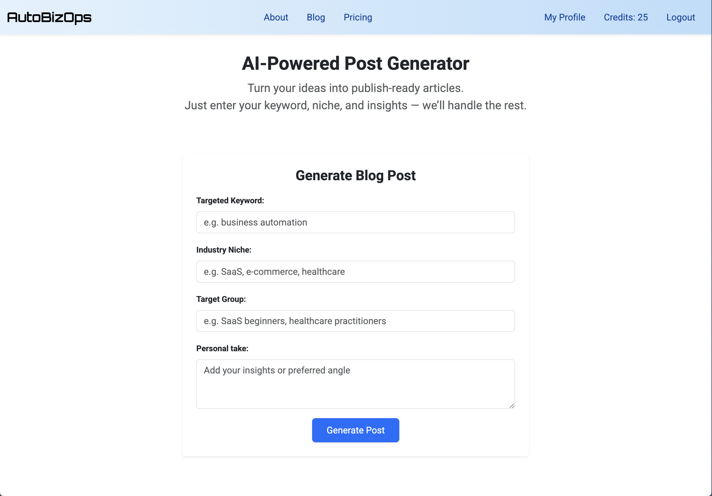
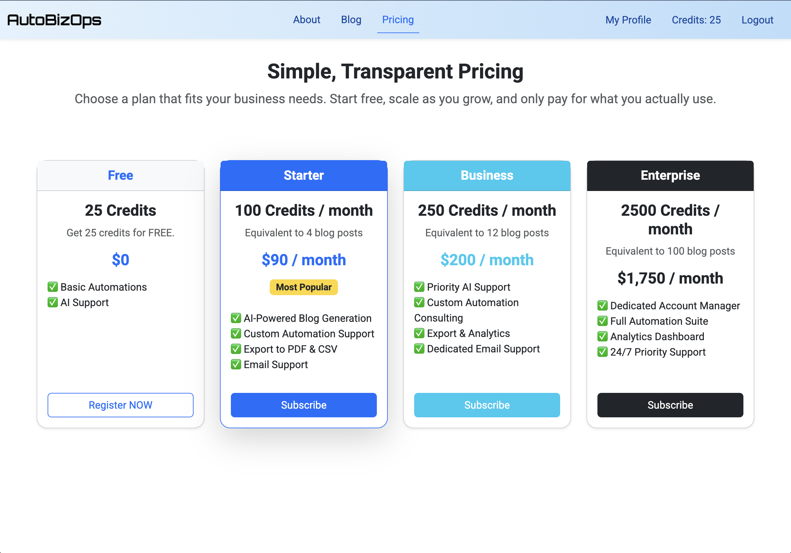
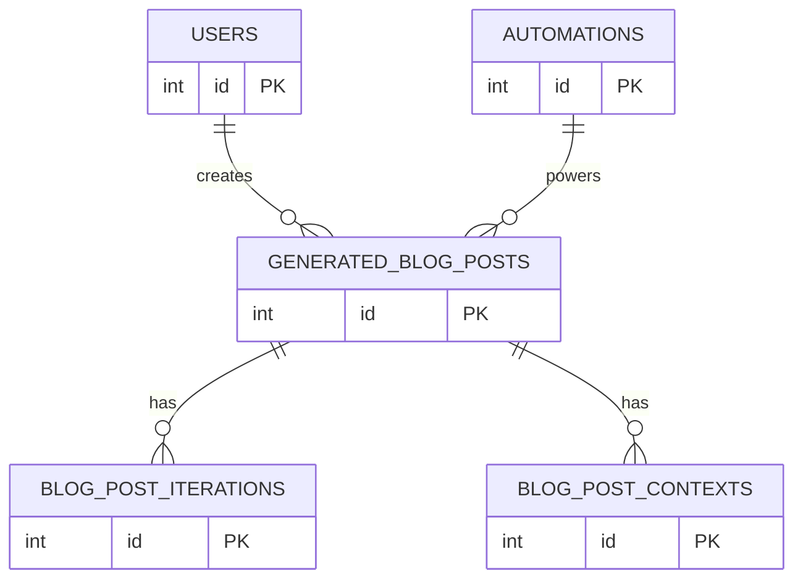

# AutoBizOps Demo 

## Overview

Creating SEO content at scale is time-consuming and costly. AutoBizOps is a demo of a system I built to automate repetitive SEO and marketing workflows, saving teams hours of manual effort.

This app demonstrates how Python, APIs, and lightweight SaaS integrations can turn complex marketing processes into repeatable, automated pipelines.

Instead of managing keywords, briefs, and reports manually, AutoBizOps automates research, content preparation, and reporting — making it easier to scale SEO without scaling costs.

---

## Demo

Live demo: *(coming soon, stay tuned!)* 😊

---

## Why It Matters

Marketing teams and agencies spend hundreds of hours doing repetitive SEO tasks. With AutoBizOps, I showed how these workflows can be:
- Automated → saving time & money
- Standardized → ensuring quality
- Scalable → supporting larger campaigns without more headcount

## Features
- Keyword Research Automation – scrape, clean, and cluster keyword data from multiple sources
- Content Brief Generator – create ready-to-use outlines for blog posts
- Workflow Orchestration – schedule and run pipelines with minimal human input

---

## Architecture

AutoBizOps follows a modular design so components can be swapped or scaled:
- Backend: Python (Flask) for APIs and task orchestration
- Data Layer: PostgreSQL for structured storage
- Integrations: n8n, Apify, AI Agents API's
- Automation: Celery for job queues, Redis for caching
- Containerization: Docker for deployment
- Frontend: Bootstrap 5.3, DataTables

---

## Screenshots

| Home Page                            | User Account                        |
|--------------------------------------|-------------------------------------|
|  |  |

| Login Page | Register Page |
|------------|---------------|
|  |  |

| Creating Post                                   | Pricing                             |
|-------------------------------------------------|-------------------------------------|
|  |  |

---

## Relationships

## Future Plans / Roadmap
- Live demo deployment
- AI-powered content evaluation
- Analytics dashboards
- Customer Support

---

## 📜 License

MIT

---

